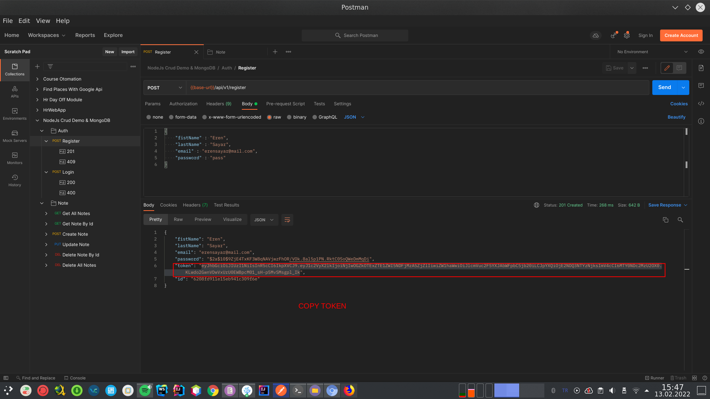
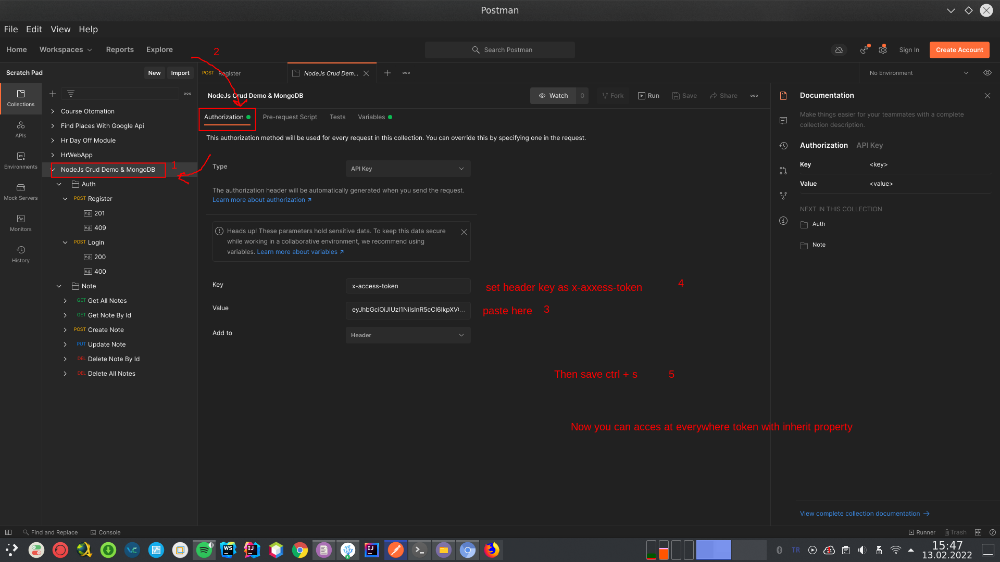

# Requirements 

* NodeJs | Install: https://nodejs.org/en/ (If you want run app as docker container don't need this)
* Docker Engine | Install: https://docs.docker.com/engine/install/
* Docker-Compose  | Install: https://docs.docker.com/compose/install/

 

# Start The Web App With Docker
You can start app image with docker-compose.

 

## Start The Dockerized App With Docker Compose
* Download the docker-compose.yml
 
  * You can find the file from github page(right here).

* Then run this command in same directory.

        $ docker-compose up

 

# Start The Web App Without Docker

* Download Project:

        $ git clone https://github.com/erensayar/Crud-Web-App-NodeJs.git

* Go to project directory:

        $ cd Crud-Web-App-NodeJs

* Run The Mongo DB
  * First of all you need start Mongo DB Server & Mongoose to run the web app. I prepared a compose file. You can find in dev-doc directory (./dev-doc/mongo&mongoose-compose-file/docker-compose.yml). 
  
  * Go to compose directory.
        
        $ cd /dev-doc/mongo&mongoose-compose-file
  
  * Run the compose file.

        $ docker-compose up

* Start The App: (In main directory. Don't forget back to main directory.)

        $ npm start

   * If you want use nodemon dev tool when developing the app, you can use this command:
        
         $ npm run dev

# Test The App

After starting the app, you can use prepared collection for test the API.

You can use postman for test api. Import my collection. And

1. Use register service and copy token.

Register SS:
 

2. Then this token paste to root collection directory, so you can use this token for every end point.

Token Paste SS:
 
